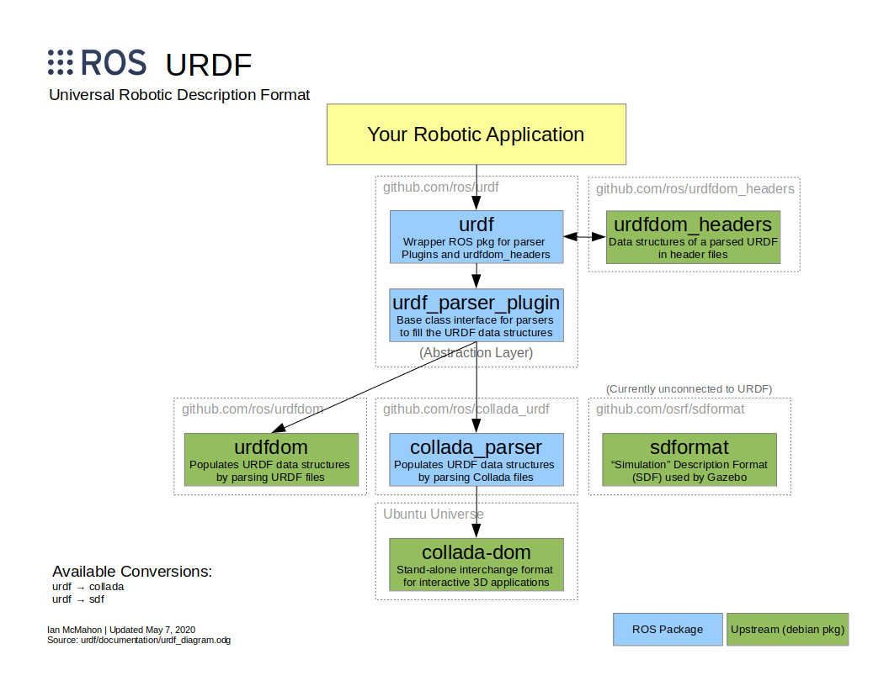

# URDF

This contains packages for working with URDF files.
See the ROS wiki for API documentation and tutorials.

* [`urdf`](http://wiki.ros.org/urdf)
* [`urdf_parser_plugin`](http://wiki.ros.org/urdf_parser_plugin)

# URDF Ecosystem

These packages were originally part of the [`ros/robot_model`](https://github.com/ros/robot_model) repository.
They have been moved to this repo as described by [`ros/robot_model#195`](https://github.com/ros/robot_model/issues/195)
